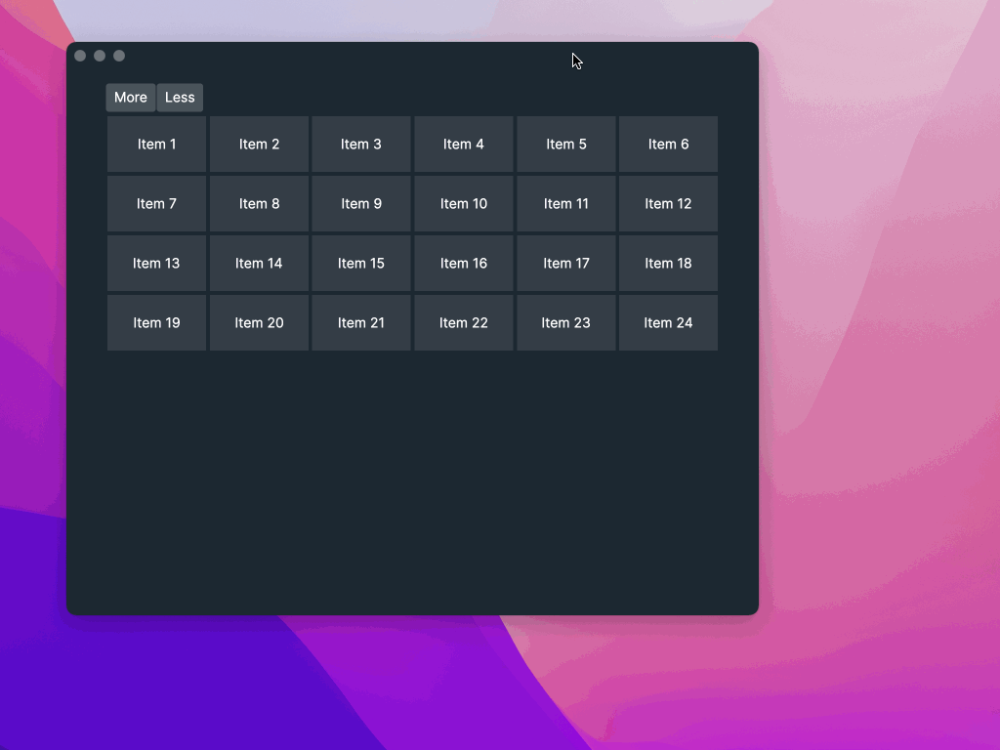

# Avalonia Fixed WrapPanel
Avalonia WrapPanel with fixed number of items per line



## How to use

1. Add NuGet package
```
MikD1.AvaloniaFixedWrapPanel
```

2. Add namesace to XAML file
```
xmlns:afwp="clr-namespace:AvaloniaFixedWrapPanel;assembly=AvaloniaFixedWrapPanel"
```

3. Use FixedWrapPanel
```
<ItemsControl Items="{Binding Items}">
    <ItemsControl.ItemsPanel>
        <ItemsPanelTemplate>
            <afwp:FixedWrapPanel ItemsPerLine="5" />
        </ItemsPanelTemplate>
    </ItemsControl.ItemsPanel>
    <ItemsControl.ItemTemplate>
        <DataTemplate>
            <Border>
                <TextBlock Text="Some text"/>
            </Border>
        </DataTemplate>
    </ItemsControl.ItemTemplate>
</ItemsControl>
```
